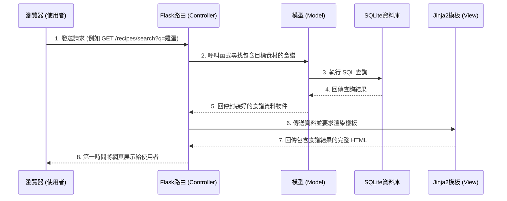

# 系統架構文件 (Architecture) - 食譜收藏夾

## 1. 技術架構說明
本系統基於輕量化與快速開發的考量，並根據 PRD 中定義的非功能需求，選擇以下技術堆疊：
- **後端框架：Python + Flask**
  - 選用原因：Flask 是一個微型 Web 框架，具備高度彈性，非常適合用來快速打造 MVP 與中小型網頁應用程式。
- **模板引擎：Jinja2**
  - 選用原因：內建於 Flask 生態系中，能夠在伺服器端直接將動態資料（如食譜清單、使用者名稱）渲染進 HTML 頁面中返回給前端，無須建立複雜的前後端分離架構。
- **資料庫：SQLite (透過 SQLAlchemy 或原生 sqlite3)**
  - 選用原因：SQLite 為輕量級的本機資料庫，不需要額外架設資料庫伺服器，能降低初始開發與部署的複雜度。未來若有需要擴展規模，要切換至 PostgreSQL 或 MySQL 也相對單純。

**Flask MVC 模式說明：**
在我們的專案中，主要採用類似 MVC（Model-View-Controller）的設計模式來分離職責：
- **Model (模型)**：負責定義資料結構與資料庫的操作（如新增食譜、查詢使用者帳號），對應資料夾 `app/models/`。
- **View (視圖)**：負責將資料呈現給使用者的介面，這裡主要是透過 HTML/CSS 以及 Jinja2 模板來達成，對應資料夾 `app/templates/`。
- **Controller (控制器)**：由 Flask 的路由（Routes）擔任，負責接收使用者的 HTTP 請求（如 GET 搜尋頁面、POST 儲存食譜）。它會決定呼叫哪一個 Model 處理資料，然後再把資料傳給對應的 View (Jinja2) 渲染成完整的網頁並回傳，對應資料夾 `app/routes/`。

## 2. 專案資料夾結構

建議採用模組化的結構，讓各功能的程式碼更容易維護與閱讀。

```text
web_app_development/
├── app/                      ← 專案主程式目錄
│   ├── __init__.py           ← 初始化 Flask 應用程式、設定資料表
│   ├── models/               ← 資料庫模型 (Models) - 資料表結構與 CRUD 操作
│   │   ├── __init__.py
│   │   ├── user.py           ← 處理使用者註冊、登入邏輯
│   │   └── recipe.py         ← 處理食譜新增、分類、查詢邏輯
│   ├── routes/               ← Flask 路由 (Controllers)
│   │   ├── __init__.py
│   │   ├── auth.py           ← 會員註冊、登入相關路由
│   │   ├── recipes.py        ← 食譜首頁、搜尋（包含食譜/食材搜尋）相關路由
│   │   └── admin.py          ← 管理員後台相關路由
│   ├── templates/            ← Jinja2 HTML 模板 (Views)
│   │   ├── base.html         ← 共用的網頁版型（導覽列、頁尾）
│   │   ├── auth/             ← 登入、註冊相關頁面
│   │   ├── recipes/          ← 食譜清單、詳細內容頁、新增/編輯食譜頁面
│   │   └── admin/            ← 後台管理頁面
│   └── static/               ← 靜態資源檔案
│       ├── css/
│       │   └── style.css     ← 自訂樣式檔案
│       ├── js/
│       │   └── main.js       ← 前端互動腳本
│       └── images/           ← 食譜預設圖片或 Logo
├── instance/                 ← 放置系統執行時產生的機密或本地端檔案
│   └── database.db           ← SQLite 資料庫實體檔案
├── docs/                     ← 專案文件目錄
│   ├── PRD.md                ← 產品需求文件
│   └── ARCHITECTURE.md       ← 系統架構文件 (本文件)
├── app.py                    ← 啟動 Flask 伺服器的入口檔案 (Entry Point)
├── requirements.txt          ← 記錄專案需要安裝的 Python 套件版本清單
└── README.md                 ← 專案說明文件
```

## 3. 元件關係圖

以下展示使用者從瀏覽器發送 HTTP 請求，一路到資料庫讀取資料的處理流程：



## 4. 關鍵設計決策

1. **採用伺服器端渲染 (Server-Side Rendering, SSR) 而不採前後端分離：**
   - **原因**：為了達成 PRD 要求的快速打造第一版 MVP，我們直接運用 Flask + Jinja2 來渲染網頁，能大幅減少初期架設 API 和建立獨立前端專案的負擔，符合以內容為主的「食譜瀏覽網站」特性。
2. **依照功能拆分資料夾層級 (`routes`, `models`, `templates`)：**
   - **原因**：比起把所有邏輯和路由都擠在一個 `app.py` 中，將控制器、資料庫互動邏輯與前端畫面明確切分，不僅能幫助開發者快速定位問題，對於專案成長後的維護性也有極大幫助。
3. **多食材組合搜尋策略：**
   - **原因**：由多種食材查詢食譜是本專案的主要亮點。作為起步，我們將在 `recipe` 資料表中設計文字型態的 `ingredients` 欄位供 ` LIKE `%食材%` 查詢，或是簡易切割比對。待後續使用者量大時，再考慮建立進階的多對多關聯（例如建立獨立的 Ingredients 資料表與食譜對應）以優化查詢效率。
4. **安全防護優先於開發便利 (利用 bcrypt 加密)：**
   - **原因**：系統具備會員身分機制，為保障使用者資料安全，儘管是小型的 MVP，仍在架構初期便決定註冊功能將採用 bcrypt 等演算法進行密碼加鹽與雜湊加密，不存明碼。
