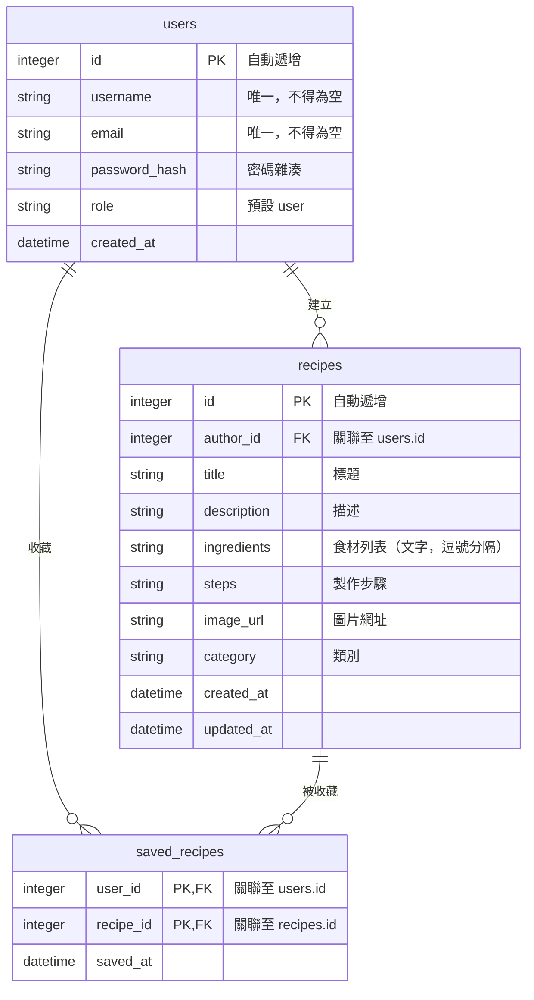

# 資料庫設計文件 (DB Design)

## ER 圖

## 資料表詳細說明

### 1. `users` (使用者資料表)
儲存系統註冊的使用者帳號資訊。
- `id` (INTEGER): PK, 自動遞增。
- `username` (VARCHAR): 使用者名稱，唯一且必填。
- `email` (VARCHAR): 電子信箱，唯一且必填。
- `password_hash` (VARCHAR): 經過加密的密碼（例如 bcrypt）。
- `role` (VARCHAR): 角色權限，例如 `user` 或 `admin`，預設為 `user`。
- `created_at` (DATETIME): 帳號建立時間。

### 2. `recipes` (食譜資料表)
儲存所有公開發布的食譜詳細資訊。
- `id` (INTEGER): PK, 自動遞增。
- `author_id` (INTEGER): FK，對應 `users.id`，必填。
- `title` (VARCHAR): 食譜標題，必填。
- `description` (TEXT): 食譜簡介。
- `ingredients` (TEXT): 所需食材。MVP 階段以字串儲存（例如："番茄,雞蛋,蔥"），後續查詢將透過 LIKE 比對，必填。
- `steps` (TEXT): 製作步驟，必填。
- `image_url` (VARCHAR): 圖片路徑。
- `category` (VARCHAR): 食譜分類（如：中式、甜點）。
- `created_at` (DATETIME): 建立時間。
- `updated_at` (DATETIME): 最後更新時間。

### 3. `saved_recipes` (收藏清單)
紀錄使用者收藏了哪些食譜，為 `users` 與 `recipes` 之間的多對多關聯表。
- `user_id` (INTEGER): FK，對應 `users.id`，與 `recipe_id` 組成 Composite PK。
- `recipe_id` (INTEGER): FK，對應 `recipes.id`，與 `user_id` 組成 Composite PK。
- `saved_at` (DATETIME): 收藏時間。
