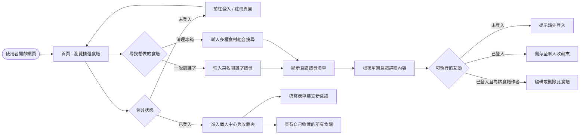
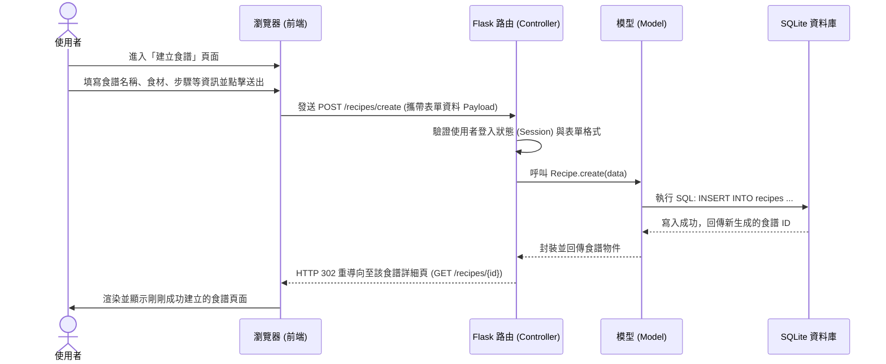

# 流程圖與對照表 (Flowchart) - 食譜收藏夾

本文件將 PRD 與架構設計轉化為視覺化的流程圖。描述了系統中「使用者的操作路徑（User Flow）」、「核心功能的系統資料流（Sequence Diagram）」，並附上了系統的「功能路徑對照表」，供後續開發與路由設計參考。

## 1. 使用者流程圖 (User Flow)

此流程圖展示了使用者進入網站後，可以進行的各項主要操作分支與畫面跳轉邏輯。

## 2. 系統序列圖 (Sequence Diagram) - 建立並儲存新食譜

本序列圖展示了在「已登入使用者建立新食譜」這項功能中，由前端提交表單到後端 Flask 處理，再存入 SQLite 資料庫的完整資料轉移流程。

## 3. 功能清單與路徑對照表

本表格將 PRD 中的需求轉譯為具體的後端路由設計，列出每個功能對應的 URL 路徑與 HTTP 方法。

| 功能區塊與描述 | HTTP 方法 | URL 路徑 | 對應 Controller (路由名稱) |
| --- | --- | --- | --- |
| **【首頁與搜尋】** | | | |
| 瀏覽首頁 (近期或推薦食譜) | GET | `/` | `index` |
| 一般關鍵字搜尋食譜 | GET | `/recipes/search` | `search_recipes` |
| 多食材組合搜尋 | GET | `/recipes/search_by_ingredients` | `search_by_ingredients` |
| 檢視單一食譜內容 | GET | `/recipes/<int:id>` | `view_recipe` |
| **【食譜管理 (需登入)】**| | | |
| 顯示建立食譜表單 | GET | `/recipes/create` | `create_recipe_form` |
| 送出建立食譜表單 | POST | `/recipes/create` | `create_recipe_submit` |
| 顯示編輯食譜表單 | GET | `/recipes/<int:id>/edit` | `edit_recipe_form` |
| 送出編輯更新 | POST | `/recipes/<int:id>/edit` | `edit_recipe_submit` |
| 刪除食譜 | POST | `/recipes/<int:id>/delete` | `delete_recipe` |
| 將食譜加入我的收藏 | POST | `/recipes/<int:id>/save` | `save_recipe` |
| 從我的收藏移除食譜 | POST | `/recipes/<int:id>/unsave` | `unsave_recipe` |
| 用戶個人主頁 (包含收藏列表) | GET | `/profile` | `user_profile` |
| **【會員身分功能】** | | | |
| 顯示註冊表單 | GET | `/auth/register` | `register_form` |
| 處理註冊送出 | POST | `/auth/register` | `register_submit` |
| 顯示登入表單 | GET | `/auth/login` | `login_form` |
| 處理登入送出 | POST | `/auth/login` | `login_submit` |
| 會員登出 | GET | `/auth/logout` | `logout` |
| **【後台管理員功能】** | | | |
| 顯示後台儀表板 | GET | `/admin` | `admin_dashboard` |
| 管理員刪除不當食譜 | POST | `/admin/recipe/<int:id>/delete`| `admin_delete_recipe` |
| 管理員封鎖/刪除帳號 | POST | `/admin/user/<int:id>/ban` | `admin_ban_user` |
